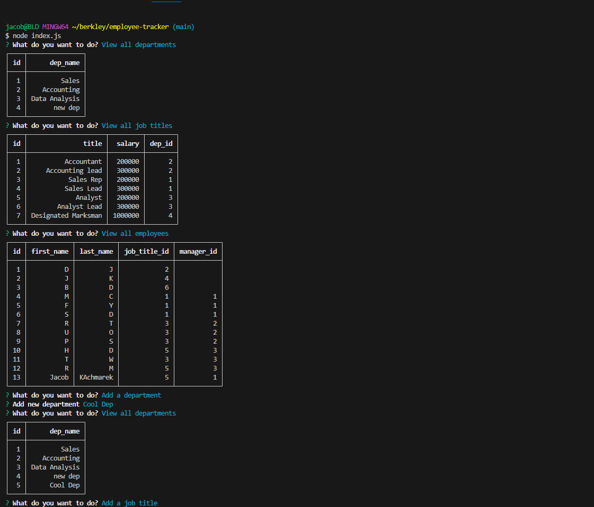
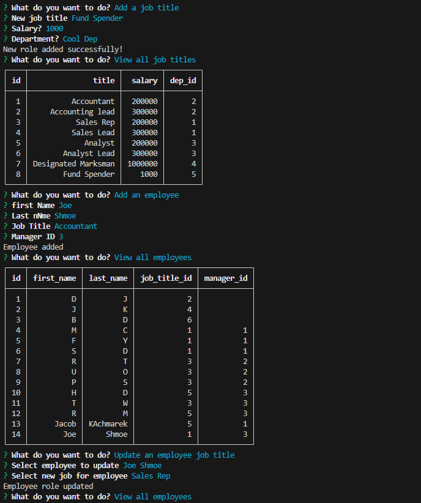
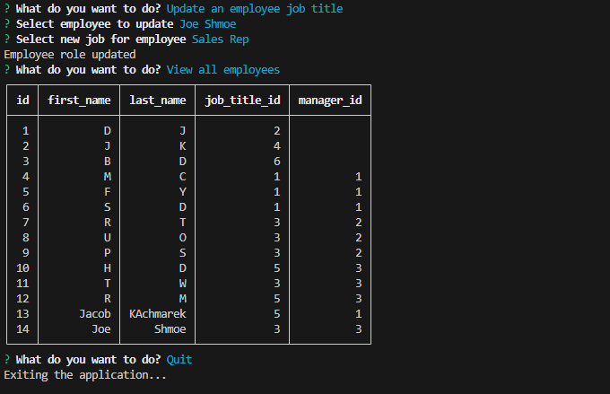

# Note Taker
  ## Description
  A simple app allowing the employer to add and update a list of all his employees their departments and their specific jobs. You can watch a video of the app working [here](https://drive.google.com/file/d/1aHSQ-7FERn1Zhl9lRD8fwS_mZvUtl6W5/view).  
  
  ## Table of Contents

  * [Installation](#installation)
  * [Usage](#usage)
  * [Contribution](#contribution)
  * [Test](#test)
  * [Contact](#contact)
  * [License](#license)

  ## Installation
  npm i

  ## Usage
  Run node index.js in your command line. You will be prompted to answer questions and choose your options simply follow along on screen. You can see the app working here. 
    
  
   
  
   
  

  ## Contribution
  Jacob Kachmarek

  ## Test 
  N/A

  ## Contact
  - Email: jacob.kachmarek@gmail.com
  - Github: https://github.com/github.com/jacob-kachmarek

  ## License 
  ### MIT
  